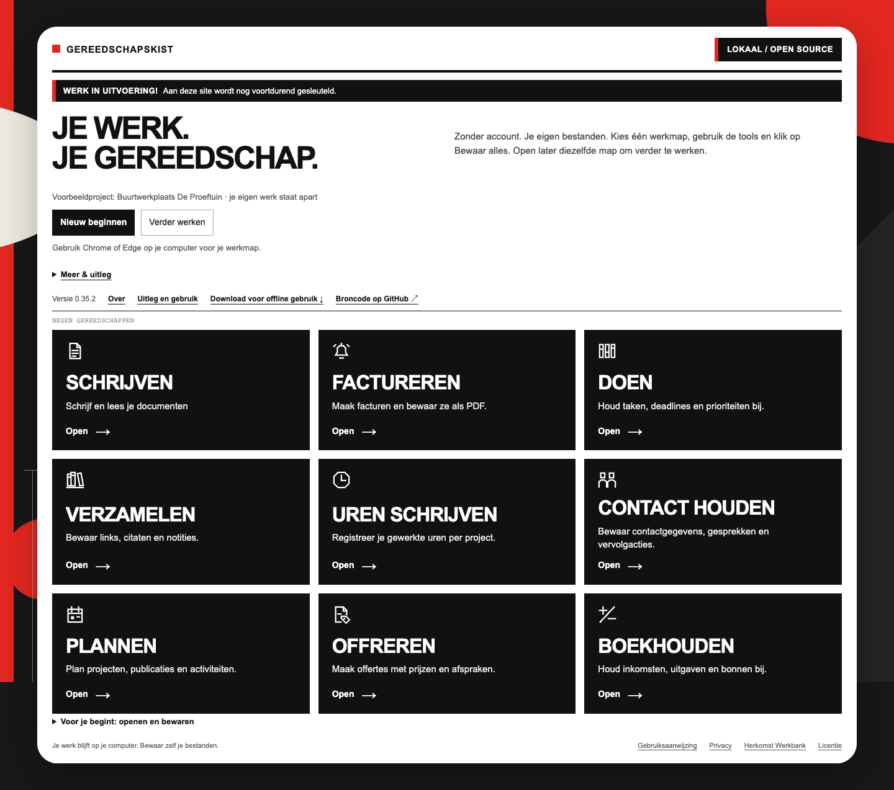

# Werkplaats

Je complete lokale werkomgeving met negen praktische tools. Geen account, installatie, externe database of API-sleutel nodig. Je werkt met je eigen bestanden.

[](https://erwinblom.github.io/gereedschapskist/)

**[Direct gebruiken](https://erwinblom.github.io/gereedschapskist/)** · **[Download voor offline gebruik](https://github.com/erwinblom/gereedschapskist/releases/latest/download/Gereedschapskist.zip)**

Download de ZIP, pak hem volledig uit en open **Begin hier.html**. De online en downloadversie hebben dezelfde bediening en gebruiken dezelfde bestanden. Ze synchroniseren niet automatisch.

| Tool | Waarvoor? |
|---|---|
| Schrijven | Markdown-documenten lezen, schrijven en ordenen |
| Factureren | Facturen maken en definitief vastleggen |
| Doen | Taken, deadlines en prioriteiten |
| Verzamelen | Links, citaten en notities |
| Uren schrijven | Gewerkte tijd bijhouden |
| Contact houden | Contactgegevens, gesprekken en vervolgacties |
| Plannen | Projecten, publicaties en activiteiten |
| Offreren | Voorstellen met prijzen en afspraken |
| Boekhouden | Inkomsten, uitgaven en bonnen |

Werkplaats staat in deze repository onder het bestaande adres `gereedschapskist`. De website en downloadlinks blijven daardoor bruikbaar.

## Eerst proberen

Nieuwe gebruikers beginnen met voorbeelden rond de fictieve Buurtwerkplaats De Proeftuin. Kies Begin met mijn eigen werk voor een lege eigen werkruimte. Bestaande eigen gegevens blijven behouden. Met Bekijk voorbeelden kun je later opnieuw oefenen, apart van je eigen werk. Voorbeeldfacturen krijgen geen definitief nummer. Gedownloade JSON-voorbeelden hebben voorbeeld in de bestandsnaam en kunnen niet als eigen administratie worden geopend. Bewaar je eigen werk altijd zelf in een bestand.

## Bediening en uitleg

[Uitleg en gebruik](https://erwinblom.github.io/gereedschapskist/Uitleg.html) beschrijft alle tools en het verschil tussen openen, browseropslag en downloaden. Elke tool toont een vaste bestandsstatus. Gewijzigde formulieren waarschuwen bij sluiten. Een downloadmelding bevestigt alleen dat de download is gestart; controleer zelf of het bestand is opgeslagen.

## Bewaar je werk

**Mijn werkmap** bewaart alles in één gekozen map, met negen toolmappen. **Bewaar bestand** schrijft dan rechtstreeks naar het vaste gegevensbestand. Bij Schrijven komt een nieuw los document in de submap Schrijven en blijft daarna gekoppeld aan dat bestand. Een document uit een andere geopende map wordt altijd in zijn eigen map opgeslagen. Bij overschrijven wordt eerst een herstelkopie gemaakt. Kies een volgende keer **Open uit werkmap**. CSV, bonnen en overdrachten komen in Exports; bij PDF kies je de map in het afdrukvenster.

Zonder werkmap downloadt **Bewaar bestand** je werk. Kies de volgende keer **Bestand openen** en selecteer je laatst bewaarde bestand. Bewaar opnieuw na wijzigingen. Browseropslag is geen back-up. Bewaar het actuele bestand voordat je overstapt tussen online en offline. Vooral bij Factureren gebruik je steeds één actuele administratie; werk niet onafhankelijk in meerdere kopieën.

Chrome en Edge op een computer zijn de aanbevolen browsers. Organisatiebeleid kan bestandskeuze, downloaden of maptoegang beperken. Schrijven kan ook losse Markdown-bestanden openen zonder toestemming voor een hele map. De downloadversie werkt zonder netwerk; de website vraagt verbinding bij het openen.

[Privacy](app/PRIVACY.md) · [Gebruiksaanwijzing](app/LEESMIJ.txt)

## Koppelingen

Bij Offreren en Boekhouden kies je **Zoek in Contacten** om op naam, organisatie of e-mail te zoeken. Met Mijn werkmap leest de kiezer het bewaarde bestand in Contact houden. Bewaar wijzigingen in Contact houden eerst met Bewaar bestand. Zonder werkmap gebruikt de online versie beschikbare browsercontacten; je kunt ook zelf een Contacten-bestand openen. De gekozen gegevens worden alleen in het open formulier ingevuld.

Gegevens overnemen werkt met lokale overdrachtsbestanden: uren naar facturen, ontvangen facturen naar Boekhouden, geplande projecten en contactacties naar taken, taken naar uren en geselecteerde bronnen naar een Markdown-document. Geaccepteerde offertes kunnen ook naar Factureren; contactgegevens kunnen naar Offreren en Factureren.

Open steeds eerst het actuele bestand in de ontvangende tool en gebruik daarna de specifieke overneemknop. Controleer en bewaar je bijgewerkte administratie. Uren zijn eerst Klaargezet; na definitief factureren geef je het factuurnummer terug via Uren als gefactureerd terugmelden / Factuurstatus bijwerken. Ontvangsten ondersteunen één volledige betaling per factuur. Dubbele overdrachten worden binnen dezelfde actuele administratie herkend. Dit is geen automatische synchronisatie.

Zie [stappen per koppeling](https://erwinblom.github.io/gereedschapskist/Uitleg.html#koppelingen) en [het open overdrachtsformaat](app/koppelingen/FORMAAT.md).

## Ontwerp

[De gedeelde ontwerpregels](ONTWERPREGELS.md) gelden voor alle tools en nieuwe functies: het werk krijgt aandacht, bediening ondersteunt en uitleg blijft op de achtergrond.

## Ontwikkeling

`app/` is de enige bron voor de tools. `docs/` is de gegenereerde website voor GitHub Pages. Bewerk `app/` en voer daarna uit:

```sh
python3 scripts/build.py
python3 scripts/check.py
```

Dat maakt ook `dist/Gereedschapskist.zip`. Publiceer de ZIP en SHA256SUMS.txt bij dezelfde release als de website. GitHub Pages gebruikt `main` → `/docs`. Voor het bouwen zijn geen Node-pakketten of builddiensten nodig. De optionele browsertests in tests/ gebruiken Playwright en Chrome.

De bestaande technische mapnamen zijn behouden voor compatibiliteit; de zichtbare appnaam is bijvoorbeeld Schrijven en Plannen.

## Herkomst en licenties

Eigen code: MIT, zie [LICENSE](LICENSE). Schrijven bouwt voort op **Markdown Browser van Joost Plattel**. Zie [herkomst](app/Apps/Werkbank/HERKOMST.md) en [licenties van gebruikte bibliotheken](app/Apps/Werkbank/THIRD_PARTY_NOTICES.md). Bijdragen zijn welkom via issues en pull requests.

## Gezamenlijke werkruimte

De gewone bewaaractie is `Bewaar alles`: complete bewaarronden inclusief concepten, één actuele verwijzing en één vorige herstelkopie. `Open werkmap` hydrateert alle bewaarde tools, ook bij lege browseropslag. Een ZIP is een optionele back-up. Interne koppelingen gebruiken gedeelde lokale sessies; losse import/export blijft beschikbaar. De bestaande werkbestanden worden niet gewist.

Controles voor deze ronde: `tests/bewaar-alles.cjs`, `tests/samenwerken.cjs` en `tests/werkruimte-ui.cjs`. De tests gebruiken een eigen browserprofiel en fictieve data; de mapkiezer wordt vervangen door een echte browserbestandssysteemmap. Een handmatige proef met de native mapkiezer blijft nodig voor browser- en organisatiebeleid.
